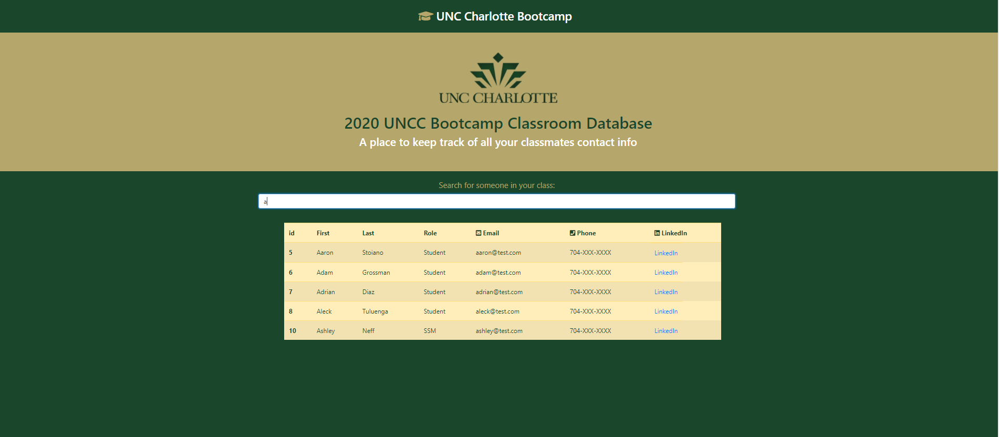

 #   react-employee
 # react-employee

 This app allows users to connect with classmates from the 2020 Full Time Web development course at UNCC. The app has all of the classmates names emails phone numbers and links to the persons linkedin profile. The app allows a user to search classmates based on their first and last name as well as sort the classmates by id. 
 
 ## Table of Contents
 * [Installation](#Installation)
 * [License](#License)
 * [Questions](#Questions)
 * [Links](#Links)
 * [Visuals](#Visuals)

 ## License
 [MIT]  This project is covered by the MIT license
 
 ## Questions
 for any questions visit my GitHub [sharkattack182](https://github.com/sharkattack182).
 or email me at matthewdc182@gmail.com.
 
 ## Links 
 [Github](https://github.com/sharkattack182/react-employee)
 [Deployed](https://powerful-lowlands-68943.herokuapp.com/)
 
 ## Visuals
 Main View
 
 Search Function
 
 Sort Function
 
